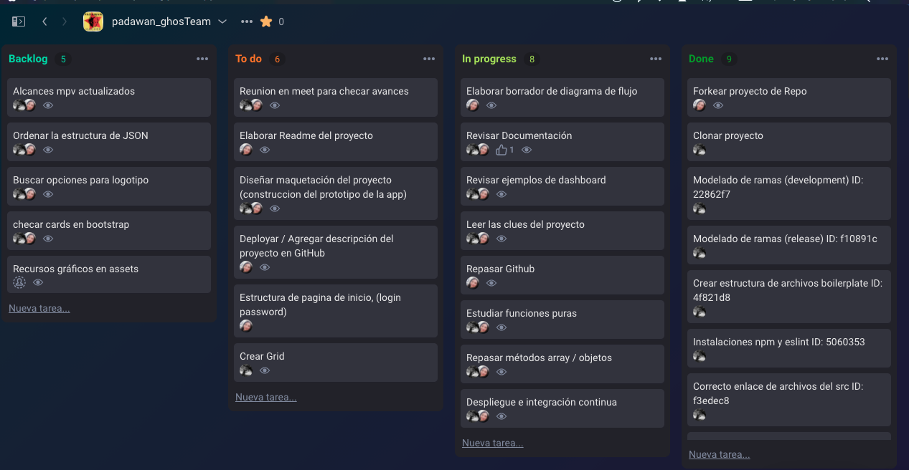
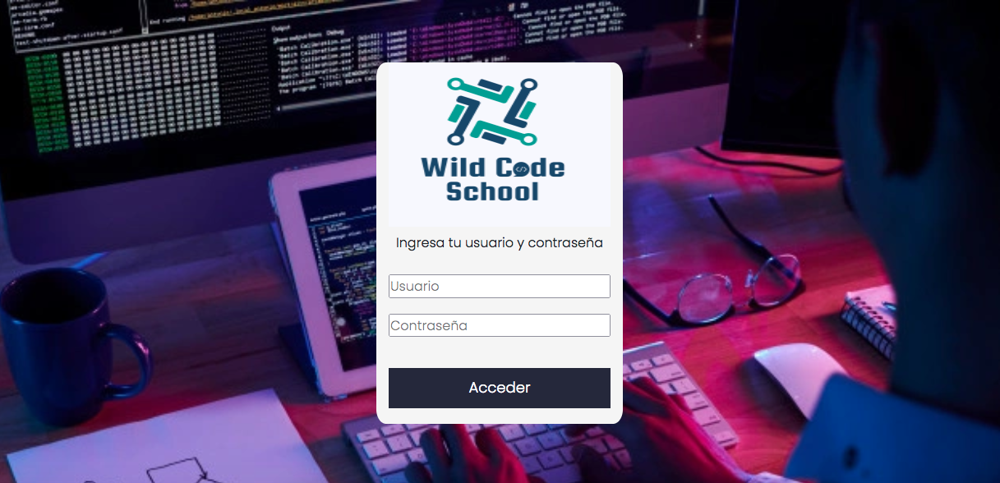

# Data dashboard app

## Introducción

1. Descripción
   Aplicación web para ver un tablero de datos para mostrar a los estudiantes datos de información de una escuela de Bootcamp de codificación, especialmente el progreso de los estudiantes en la plataforma de estudio.

2. Definición de usuario:
   Usuario: Rector de la escuela bootcamp para analizar e interpretar los datos de los alumnos

Historias de usuarios:
La interfaz debe permitir al usuario:

Muestre un inicio de sesión con el logotipo de Bootcamp School para el director de la escuela.
Tenga una primera vista que enumera las 3 ubicaciones de la escuela Bootcamp y haga clic en cada una que muestra la página de la sucursal.
Muestre la información solo para esa sucursal en esta vista separada, esta vista debe tener el nombre de la sucursal y una imagen de la ubicación también, muestre también las generaciones disponibles para hacer clic y encontrar los estudiantes registrados para cada generación.
Para cada generación:
Muestre cuántos estudiantes se registraron en tarjetas
Filtrar y poder buscar alumnos por nombre
Muestra el promedio porcentual de generación del progreso de finalización
Mostrar para identificar a los estudiantes con un porcentaje inferior al 60
Mostrar para identificar a los estudiantes con 90 o más de porcentaje de competencia.
Enumere y pueda seleccionar a los estudiantes que muestren el porcentaje general de finalización de cada estudiante, ordenados por nombre alfabéticamente.
Para cada alumno:
Poder hacer clic en para mostrar el informe de progreso:
Mostrar porcentaje completado para todos los temas
Calcule el porcentaje de tiempo completado para cada tema.
Enumere los subtemas de cada tema
Capacidad para filtrar subtemas completados y no completados de cada tema.
Ser capaz de filtrar subtemas por tipo (ejercicios, lecturas y cuestionarios) 3. Criterios de aceptación
Utilice la interfaz sin problemas desde diferentes tamaños de pantalla: móviles, tabletas, ordenadores de sobremesa
Realizar pruebas unitarias para "funciones puras"
Cubre todos los EE. UU.
Edición Hacker 4. Requisitos técnicos /
Programación en equipo en pareja
Bifurque este repositorio y clone el suyo, elija quién será el propietario del repositorio del equipo de pares.
Empiece a trabajar haciendo npm init
Configure un archivo .gitignore para evitar que los node_modules se carguen en GitHub.
Cree la rama de lanzamiento (para entregar e implementar) y la rama de desarrollo (para trabajar en ella a diario).
Cree un sitio web completamente receptivo considerando un sitio receptivo para todos los dispositivos.
Siga las reglas de HTML semántico, tenga encabezado, barra de navegación, principal, secciones, apartes, pie de página, etc.
Cree una carpeta de Activos para almacenar los activos del sitio.
Documente todos los pasos del SDLC ágil en ReadMe.md. Durante el paso de planificación, documente una captura de pantalla de su Backlog y la agenda priorizada para cada uno.
Use Bootstrap Framework para acelerar la codificación de su interfaz de usuario. Bootstrap es la biblioteca única permitida.
Dos sprints de una semana cada uno con demostración bilingüe los jueves a las 10 am.
Para la segunda demostración, prepárese para tener usuarios de prueba que probarán su producto y verán su demostración.

---

Índice

    1. Descripción
    2. Historias de Usuario (UX)
    3. Criterios de aceptación
    4. Requerimientos técnicos
    5. Pseudocódigo 📋
    6. Expectativa de conocimientos adquiridos

---

## 1. Descripción

Aplicación web para ver un tablero de datos para mostrar a los estudiantes datos de información de una escuela de Bootcamp de codificación, especialmente el progreso de los estudiantes en la plataforma de estudio.

## 2. Definición de usuario

**Usuario: Director de una escuela de desarrollo web**

## Historias de Usuario (UX)

La interfaz debe permitirle al usuario:

- Muestre un inicio de sesión con el logotipo de Bootcamp School para el director de la escuela.
- Tenga una primera vista que enumera las 3 ubicaciones de la escuela Bootcamp y haga clic en cada una que muestra la página de la sucursal.
- Muestre la información solo para esa sucursal en esta vista separada, esta vista debe tener el nombre de la sucursal y una imagen de la ubicación también, muestre también las generaciones disponibles para hacer clic y encontrar los estudiantes registrados para cada generación.
- Para cada generación:
  Muestre cuántos estudiantes se registraron en tarjetas
  Filtrar y poder buscar alumnos por nombre
  Muestra el promedio porcentual de generación del progreso de finalización
  Mostrar para identificar a los estudiantes con un porcentaje inferior al 60
  Mostrar para identificar a los estudiantes con 90 o más de porcentaje de competencia.
  Enumere y pueda seleccionar a los estudiantes que muestren el porcentaje general de finalización de cada estudiante, ordenados por nombre alfabéticamente.
  - Para cada alumno:
    Poder hacer clic en para mostrar el informe de progreso:
    Mostrar porcentaje completado para todos los temas
    Calcule el porcentaje de tiempo completado para cada tema.
    Enumere los subtemas de cada tema
    Capacidad para filtrar subtemas completados y no completados de cada tema.
    Ser capaz de filtrar subtemas por tipo (ejercicios, lecturas y cuestionarios)

## _Proceso de flujo de trabajo_

Se utiliza el método agile para distribuir las tareas del proyecto



---

## 3. _UI(user interface)_

### Maquetación




---

## _Diagrama de flujo_

## 3. Criterios de aceptación

- Poder correr la app desde diferentes tamaños de pantalla: móviles, tabletas, ordenadores de sobremesa
  Realizar pruebas unitarias para "funciones puras"
  Cubre todas las Historias de Usuario.

El _boilerplate_ debe contener la siguiente structura de archivos, comenzando por la instalacion de dependencias y configuracion de tests.

```
./
├── .editorconfig
├── .eslintrc
├── .gitignore
├── README.md
├── package.json
├── assets
└── data
    ├── students.json
├── src
│   ├── app.js
│   ├── data.js
│   ├── index.html
│   ├── index.js
│   └── style.css
└── test
    ├── app.spec.js
    └── index.html
```

---

## 5.Pseudocódigo 📋

---

## 6. Expectativa de conocimientos adquiridos

---

- [ ] npm init
- [ ] JSON
- [ ] fetch() method
- [ ] promises in JavaScript
- [ ] iterate data
- [ ] array methods and iterators
- [ ] object iterators and key finders
- [ ] import & export modules
- [ ] My first Unitary Testing
- [ ] GitHub Branch Modeling > Development > Release

---
