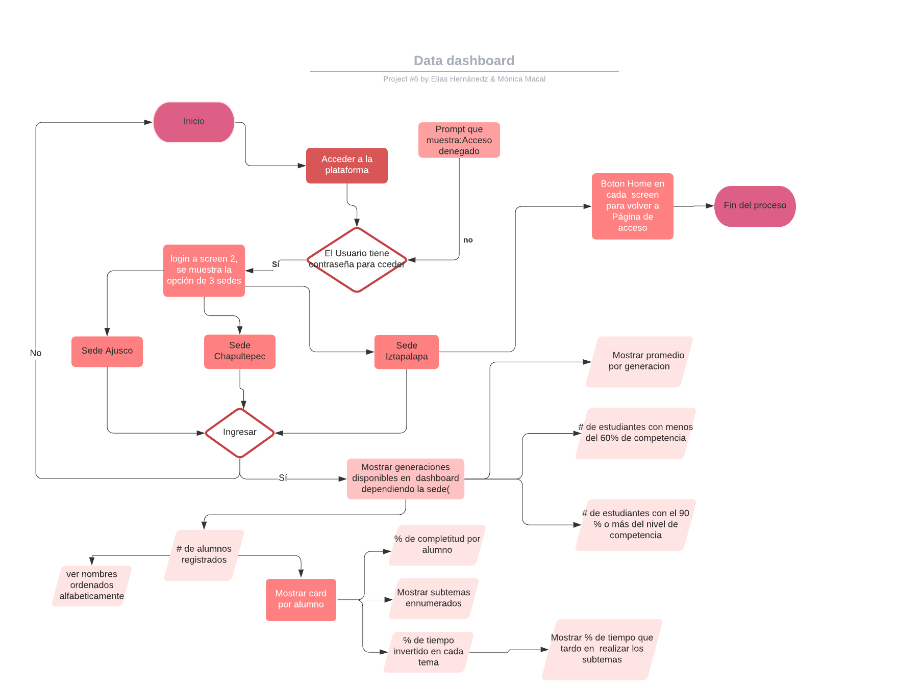

# Data dashboard app

## Introducción

1. Descripción
   Aplicación web para ver un tablero de datos para mostrar a los estudiantes datos de información de una escuela de Bootcamp de codificación, especialmente el progreso de los estudiantes en la plataforma de estudio.

2. Definición de usuario:
   Usuario: Rector de la escuela bootcamp para analizar e interpretar los datos de los alumnos, especialmente el rendimiento de los alumnos por cada generación.

Historias de usuarios:
La interfaz debe permitir al usuario:

- Muestre un inicio de sesión con el logotipo de Bootcamp School para el director de la escuela.
- Tenga una primera vista que enumera las 3 ubicaciones de la escuela Bootcamp y haga clic en cada una que muestra la página de la sucursal.
- Muestre la información solo para esa sucursal en esta vista separada, esta vista debe tener el nombre de la sucursal y una imagen de la ubicación también, muestre también las generaciones disponibles para hacer clic y encontrar los estudiantes registrados para cada generación.
- Para cada generación:
- Muestre cuántos estudiantes se registraron en tarjetas
- Filtrar y poder buscar alumnos por nombre
- Muestra el promedio porcentual de generación del progreso de finalización
- Identificar a los estudiantes con un porcentaje inferior al 60
- Identificar a los estudiantes con 90 o más de porcentaje de competencia.
- Enumere y pueda seleccionar a los estudiantes que muestren el porcentaje general de finalización de cada estudiante, ordenados por nombre alfabéticamente.
- Para cada alumno:
- Poder hacer clic en para mostrar el informe de progreso:
- Mostrar porcentaje completado para todos los temas
- Calcule el porcentaje de tiempo completado para cada tema.
- Enumere los subtemas de cada tema
- Capacidad para filtrar subtemas completados y no completados de cada tema.
- Ser capaz de filtrar subtemas por tipo (ejercicios, lecturas y cuestionarios) 3.

---

Índice

    1. Descripción
    2. Historias de Usuario (UX)
    3. Criterios de aceptación
    4. Requerimientos técnicos
    5. Pseudocódigo 📋
    6. Expectativa de conocimientos adquiridos

---

## 1. Descripción

Aplicación web para ver un tablero de datos para mostrar a los estudiantes datos de información de una escuela de Bootcamp de codificación, especialmente el progreso de los estudiantes en la plataforma de estudio.

## 2. Definición de usuario

Usuario: Director de una escuela de desarrollo web

## Historias de Usuario (UX)

La interfaz debe permitirle al usuario:

- Muestre un inicio de sesión con el logotipo de Bootcamp School para el director de la escuela.
- Tenga una primera vista que enumera las 3 ubicaciones de la escuela Bootcamp y haga clic en cada una que muestra la página de la sucursal.
- Muestre la información solo para esa sucursal en esta vista separada, esta vista debe tener el nombre de la sucursal y una imagen de la ubicación también, muestre también las generaciones disponibles para hacer clic y encontrar los estudiantes registrados para cada generación.
- Para cada generación:
  Muestre cuántos estudiantes se registraron en tarjetas
  Filtrar y poder buscar alumnos por nombre
  Muestra el promedio porcentual de generación del progreso de finalización
  Mostrar para identificar a los estudiantes con un porcentaje inferior al 60
  Mostrar para identificar a los estudiantes con 90 o más de porcentaje de competencia.
  Enumere y pueda seleccionar a los estudiantes que muestren el porcentaje general de finalización de cada estudiante, ordenados por nombre alfabéticamente.
  - Para cada alumno:
    Poder hacer clic en para mostrar el informe de progreso:
    Mostrar porcentaje completado para todos los temas
    Calcule el porcentaje de tiempo completado para cada tema.
    Enumere los subtemas de cada tema
    Capacidad para filtrar subtemas completados y no completados de cada tema.
    Ser capaz de filtrar subtemas por tipo (ejercicios, lecturas y cuestionarios)

## Proceso de flujo de trabajo

Se utiliza el método agile para distribuir las tareas del proyecto


---

## 3. UI(user interface)

### Maquetación


---

## Diagrama de flujo



## 3. Criterios de aceptación

- Poder correr la app desde diferentes tamaños de pantalla: móviles, tabletas, ordenadores de sobremesa
- Realizar pruebas unitarias para "funciones puras"
- Cubre todas las Historias de Usuario.

El _boilerplate_ debe contener la siguiente structura de archivos, comenzando por la instalacion de dependencias y configuracion de tests.

```
./
├── .editorconfig
├── .eslintrc
├── .gitignore
├── README.md
├── package.json
├── assets
└── data
    ├── students.json
├── src
│   ├── app.js
│   ├── data.js
│   ├── index.html
│   ├── index.js
│   └── style.css
└── test
    ├── app.spec.js
    └── index.html
```

---

## 5.Pseudocódigo 📋

---

## 6. Expectativa de conocimientos adquiridos

---

- [ ] npm init
- [ ] JSON
- [ ] fetch() method
- [ ] promises in JavaScript
- [ ] iterate data
- [ ] array methods and iterators
- [ ] object iterators and key finders
- [ ] import & export modules
- [ ] My first Unitary Testing
- [ ] GitHub Branch Modeling > Development > Release

---
